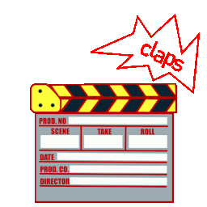

#Movie APP

 

A project made by [**Maria Diana Noaghiul**](https://github.com/DianaNoSpace4Bugs), [**Alejandro Márquez Andrade**](https://github.com/alejandroFMA) and [**Gregorio Tremont**](https://github.com/GREGORIOtsr).

## Introduction

This project is based on a web application for searching and managing movies, where functionalities have been implemented and tools related to both frontend and backend development have been utilized.

## How the application works

This web application operates as follows:

1. Log in with your email and password, or use Google authentication.
1. If you don't have an account on this website, register with your email, username, and password.
1. Once identified, depending on your role as a 'user' or 'administrator,' you will have different options:

If you are a user:

- Your profile will be displayed, where you can modify your username if desired.
- Through the navigation menu, you can access functionalities such as the 'movie search' in the database, add movies to favorites, view details of desired movies, and manage a 'list of favorite movies.'

If you are an administrator:

- Your profile will be shown, allowing you to modify your username and view movies you have created.
- Through the navigation menu, you can access functionalities like 'create movie,' where a form will be completed to save the data of a new movie in the database, and 'edit movie,' searching among existing movies.

Both users and administrators have the option to log out at any time.

## What did we use for this implementation?

- GitHub for working by branches.
- Relational and non-relational databases => MongoDB and SQL, with Mongoose and Sequelize.
- Authentication with JWT
- Authentication with Google
- PugJS Template Engine
- Use of Regular Expressions (RegEx)
- HTML, CSS, JavaScript
